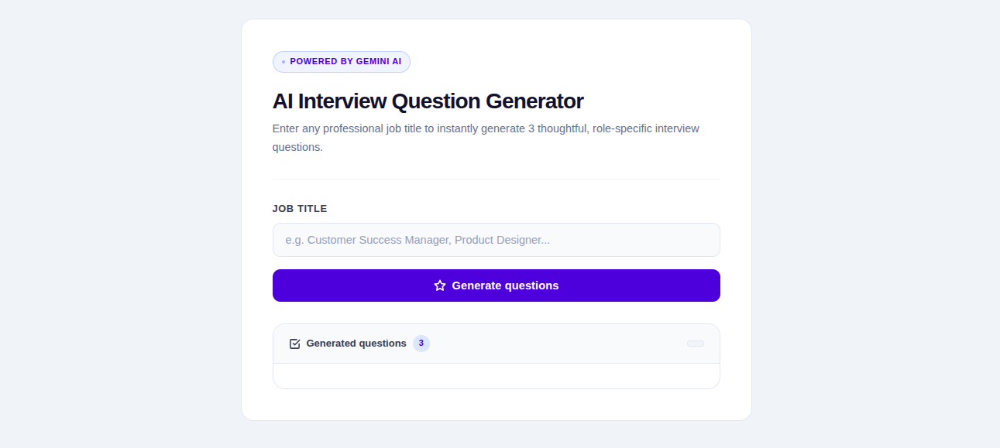
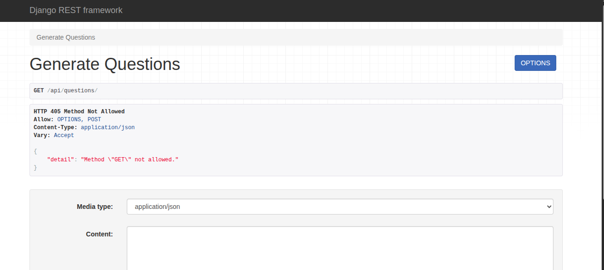

# AI Interview Question Generator

A web app that generates 3 role-specific interview questions from any job title, powered by Google Gemini AI.

**Live Demo:** [your-vercel-url]  
**Backend API:** [your-render-url]

---

## Preview

### UI


### API Endpoint


---

## Project Structure

```
ai-interview-question-generator/
├── frontend/
│   ├── index.html
│   ├── style.css
│   └── app.js
├── backend/
│   ├── api/
│   │   ├── views.py
│   │   └── urls.py
│   ├── config/
│   │   └── wsgi.py
│   ├── manage.py
│   ├── requirements.txt
│   ├── runtime.txt
│   ├── build.sh
│   └── render.yaml
├── .env-example
├── .gitignore
└── README.md
```

---

## Tech Stack

| Layer    | Technology |
|----------|------------|
| Frontend | HTML, CSS, JavaScript |
| Backend  | Django, Django REST Framework |
| AI       | Google Gemini API (`google-generativeai`) |
| Hosting  | Vercel (frontend) · Render (backend) |

---

## Getting Started

### Prerequisites
- Python 3.10+
- A Gemini API key — [get one free at Google AI Studio](https://aistudio.google.com)

### Backend Setup

```bash
git clone git@github.com:Ulricharmel001/role-base-ai-interview-question-generator.git
cd ai-interview-question-generator/backend
pip install -r requirements.txt
```

Copy the example env file and add your key:
```bash
cp ../.env-example .env
```

`.env` file:
```
GEMINI_API_KEY=your_api_key_here
```

Run the server:
```bash
python manage.py runserver 8001
```

### Frontend Setup

No build step needed. Open `frontend/index.html` directly in your browser, or serve it with any static host.

---

## How It Works

1. User enters a job title and clicks **Generate questions**
2. Frontend sends a `POST` request to `/api/questions/`
3. Backend validates the input, then sends a structured prompt to Gemini
4. Gemini acts as both validator and question generator:
   - Returns `INVALID_ROLE` if the job title is not a real professional role
   - Returns exactly 3 numbered questions if valid
5. Frontend parses and renders the questions as individual cards

---

## API

### `POST /api/questions/`

**Request**
```json
{ "job_title": "Customer Success Manager" }
```

**Success response**
```json
{
  "success": true,
  "job_title": "Customer Success Manager",
  "questions": "1. Question one\n2. Question two\n3. Question three"
}
```

**Error response**
```json
{
  "success": false,
  "error": "This does not appear to be a valid job title."
}
```

---

## Model Fallback Strategy

The backend cycles through three Gemini models in order. If one hits its rate limit (429), it automatically tries the next:

```
gemini-2.5-flash-lite  →  gemini-2.5-flash  →  gemini-3-flash
     (fastest)               (balanced)          (most capable)
```

This keeps the app working even when free tier limits are reached.

---

## Environment Variables

| Variable         | Description                |
|------------------|----------------------------|
| `GEMINI_API_KEY` | Your Google Gemini API key |

A `.env-example` file is included at the root — copy it and fill in your key.

---

## Deployment

**Frontend** — deploy the `frontend/` folder to Vercel

**Backend** — deploy the `backend/` folder to Render:
1. Set build command: `./build.sh`
2. Set start command: `gunicorn config.wsgi:application`
3. Add `GEMINI_API_KEY` under Environment Variables in the Render dashboard

---
